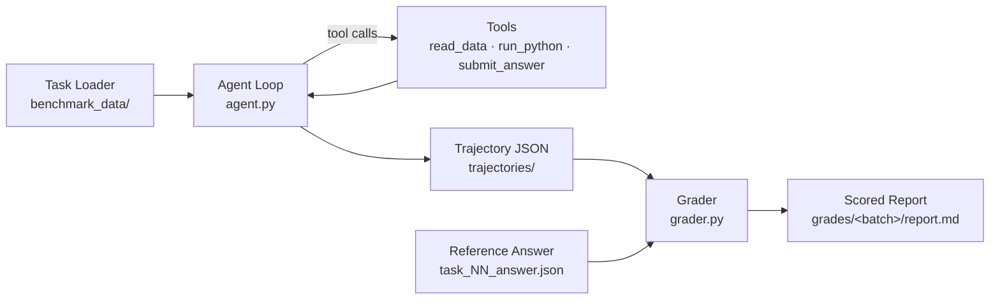

# Mini QoE Agent Benchmark

A 6-task agent benchmark that measures whether a frontier LLM can perform Quality-of-Earnings (QoE) financial diligence: read structured data, reason over it, do real math in a Python sandbox, and produce a structured, gradable answer. Each run captures a full reasoning trajectory and is scored on a 3-dimension rubric.

**Status:** v0.1 proof of harness — 6 tasks, single agent model, single judge model.
**Worked example:** [`grades/04196acd-…/report.md`](grades/04196acd-4f69-4a6a-8daf-62c09fb22f8c/report.md) — a real run scored across all 6 tasks.

---

## Quickstart

```bash
# 1. Install
pip install anthropic pandas numpy python-dotenv

# 2. Set credentials
echo 'ANTHROPIC_API_KEY=sk-ant-...' > .env

# 3. Run all 6 tasks
python agent.py

# 4. Grade the run you just produced
python grader.py
# -> writes grades/<batch_uuid>/report.md
```

To run a single task:
```bash
python agent.py task_03
```

To grade a specific batch or a single trajectory:
```bash
python grader.py <batch_uuid>
python grader.py trajectories/task_01_<run_uuid>.json
```

---

## Architecture



Two scripts, one loop each:

- **[agent.py](agent.py)** — single `client.messages.create` loop over the Anthropic SDK with three custom tools. Runs until the agent calls `submit_answer` or hits `MAX_ITERATIONS=12`. Writes one self-contained trajectory JSON per task, plus a `batch_*.json` summary when run across all tasks.
- **[grader.py](grader.py)** — reads a trajectory, scores three dimensions (correctness / tool use / reasoning) 0-3, writes per-task grade JSONs and an aggregate `report.md`.

### Repository layout

```
agent.py                   # agent loop + multi-task runner
grader.py                  # deterministic checks + LLM-as-judge scoring
CLAUDE.md                  # operating notes for Claude Code
benchmark_data/            # per-task: lean prompt, full prompt, CSV(s), answer JSON
trajectories/              # one JSON per agent run + batch_*.json summaries
grades/<batch_uuid>/       # per-task grade JSONs + report.md
```

---

## The three tools

| Tool | Purpose | Why it exists |
|---|---|---|
| `read_data(file_name)` | Returns raw CSV/text contents of a file in `benchmark_data/`. | Forces the agent to navigate structured data itself rather than receiving pre-parsed inputs — exposes data-handling reasoning. |
| `run_python(code)` | Executes Python in a persistent namespace preloaded with `pandas` and `numpy`. State carries across calls within a task. | Multi-step financial reasoning needs real computation. Letting the model write code keeps the eval honest — it cannot fake math in natural language. |
| `submit_answer(answer, reasoning, flags)` | Submits the final structured answer and terminates the loop. | Forces a gradable output shape. Without this the agent might trail off in prose and grading becomes ambiguous. |

Three is the minimum viable set for this task class. Adding more tools (a dedicated aggregator, a chart tool, a SQL tool) would hide reasoning behind tool affordances and weaken what the eval measures.

---

## The rubric

Each task produces three independent scores, 0-3:

1. **Final answer correctness** — deterministic numeric tolerance checks (per-field specs: `dollar` ±$100, `ratio_pct` ±1pp, `exact_string`, `set_overlap`) plus LLM-as-judge semantic matching on free-text flags.
2. **Tool use appropriateness** — deterministic gate (must call all `minimum_tools_required`) + LLM judge against the task's `good_pattern` / `anti_patterns`.
3. **Reasoning quality** — LLM judge over the abridged conversation against rubric anchors.

The judge uses **forced tool calls** with single-purpose tools (`record_grade`, `record_flag_match`) — this is the structured-output pattern; the judge cannot drift into free-form prose.

A 4-point scale (0-3) is deliberate: 5- and 10-point scales let judges drift to the middle. 0-3 forces commitment — *good, acceptable, flawed, or broken*.

---

## The six tasks

| ID | Task | Capability tested |
|---|---|---|
| 01 | Revenue concentration | Aggregation + ranking + threshold flagging |
| 02 | AR aging risk | Date math + multi-bucket filter + customer concentration |
| 03 | T3M annualized run rate | Time-window filtering + run-rate math + pattern interpretation |
| 04 | Customer churn impact | Two-table comparison + set difference + dollar-weighted summary |
| 05 | Non-recurring expense ID | Classification using context cues + filtered aggregation |
| 06 | EBITDA bridge | Multi-step composition: classify + sum + reconcile against target |

Each task has both a `task_NN_prompt.md` (long-form) and a `task_NN_prompt_lean.md` (what the agent actually receives). Discovery is by the lean file's glob.

---

## Design decisions

### No orchestration framework — direct Anthropic SDK

A 3-tool linear agent loop is the canonical use case for the SDK's native tool use, not for an orchestration framework. LangGraph, LangChain, LlamaIndex, and DSPy each solve problems this benchmark does not have: branching control flow, multi-agent orchestration, RAG infrastructure, prompt optimization. At this scale, a framework trades **transparency for ceremony** — and for an eval artifact where inspectability *is* the deliverable, transparency wins.

A framework would earn its weight at production scale (many concurrent runs, distributed observability, replay infrastructure) or with multi-agent orchestration. Neither applies to a 6-task benchmark with synchronous execution. The full message history, every tool call, every token count is already captured in the trajectory JSON — no framework needed to introspect it.

### Persistent Python namespace across `run_python` calls

`_PY_NAMESPACE` is a module-global `dict` that `exec` writes into. Variables and dataframes persist across calls within a task, then are reset between tasks. This is intentional: it matches how an analyst actually works — load the CSV once, build up intermediate dataframes, ask follow-up questions. Without persistence the agent would either re-parse the CSV on every call or cram everything into a single `run_python`, both of which distort the trajectory.

The trade-off is that **task execution cannot be parallelized as-written** — the namespace would cross-contaminate. Parallelization is a v2 concern.

### Rubric grounding lives with the task, not the grader

Per-task `tolerance`, `expected_flags`, and `tool_use_criteria` live inside each `task_NN_answer.json`, not as constants inside `grader.py`. The grader always reads the *current on-disk* answer file, never the `reference_answer` embedded in old trajectories. This means the rubric can evolve without re-running the agent — re-grade an old run against a tightened rubric just by editing the answer JSON.

### Forced tool calls for the judge

Instead of asking the judge for JSON in free text and parsing it, the judge is given a single `record_grade` tool with `tool_choice={"type": "tool", ...}`. The model has no other way to respond. This eliminates parsing errors, schema drift, and prompt-injection-style escape routes.

### `disable_parallel_tool_use=True`

Forces a strict serial trajectory — one tool call per turn. Parallel calls would make the tool-use rubric ambiguous (what counts as "redundant" when two calls happen simultaneously?) and complicate trajectory readability. The cost is a few extra latency turns; the benefit is a clean, gradable trace.

### Two models, two roles

- Agent: `claude-sonnet-4-6` — the system under test.
- Judge: `claude-opus-4-7` — a stronger, different-checkpoint model to reduce self-preference bias when grading.

Both are hard-coded at the top of their respective modules. Changing them is a deliberate one-line edit, not an env var, because the rubric and the trajectory together are only meaningful relative to the model that produced them.

---

## Known limitations (v1)

- **6 tasks is not statistically meaningful.** This is a proof of harness, not a production eval. A real engagement needs 100+ tasks per capability category with confidence intervals.
- **Synthetic data is too clean.** Real diligence data has mixed formats, OCR errors, footnotes, inconsistent column naming. This benchmark tests reasoning over clean data, not data wrangling under uncertainty.
- **Single-model evaluation.** No cross-model baseline — the rubric is not calibrated against "what does a strong vs weak trajectory look like."
- **LLM-as-judge not calibrated against human experts.** A production version would run 30-50 trajectories through 2-3 expert QoE analysts, measure inter-rater reliability (Cohen's κ), and iterate until κ > 0.7 before relying on LLM-as-judge.
- **Tasks selected from one analyst's intuition.** Defensible but not derived from a representative QoE task taxonomy.

---

## Trajectory schema

Each run writes `trajectories/task_NN_<run_uuid>.json` containing:

- `task_id`, `run_id`, `timestamp`, `model`
- `task_prompt` and `reference_answer` (snapshot)
- `messages[]` — full conversation, including tool_use and tool_result blocks
- `tool_calls[]` — flattened tool invocations with `input`, `output` (truncated to 5000 chars in the log; the *model* still sees the full result), `duration_ms`, `error`
- `final_answer`, `iterations`, `terminated_by` (`submit_answer` / `end_turn` / `max_iterations` / `error`)
- `total_input_tokens`, `total_output_tokens`

The trajectory is the unit of grading and the unit of debugging. Everything you need to reproduce or audit a run is in one self-contained JSON file.
